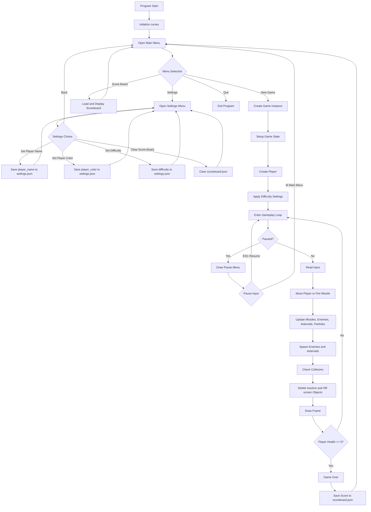

# Space Shooter

A small terminal-based Python arcade shooter built with `curses`.

The player controls a ship on the left side of the screen, dodges enemy fire and asteroids, and shoots incoming objects for points. The game includes a main menu, scoreboard, player color settings, difficulty settings, pause handling, local settings, and local score saving.

## Features

- Terminal/curses arcade gameplay
- Main menu with New Game, Score Board, Settings, and Quit
- Player movement with WASD or arrow keys
- Spacebar shooting
- Enemy ships, enemy missiles, and asteroids
- Explosion particle effects
- Player health bar
- Difficulty selection: Easy, Medium, Hard
- Local scoreboard saved to `scoreboard.json`
- Local settings saved to `settings.json`

## Requirements

### Python

- Python 3.10 or newer recommended

### Required packages

On Windows:

```bash
pip install windows-curses
```

On Linux/macOS:

```bash
# curses is usually included with Python
```

No external game engine is required.

## How to Run

From the project folder:

```bash
python space_shooter.py
```

On Windows, depending on your Python setup:

```bash
py space_shooter.py
```

## Controls

| Action | Key |
|---|---|
| Move | WASD or Arrow Keys |
| Fire | Space |
| Pause / Resume | ESC |
| Return to menu while paused | M |
| Menu navigation | Arrow Keys |
| Select menu option | Enter |

## Local Files

The game creates local runtime files:

| File | Purpose |
|---|---|
| `settings.json` | Stores player name, color, difficulty, and attempt number |
| `scoreboard.json` | Stores local high scores |

## Gameplay Flow

1. Main menu opens.
2. Player can start a new game, view the scoreboard, adjust settings, or quit.
3. Player can change difficulty, player name, and player color from Settings.
4. New Game starts using the selected difficulty.
5. The selected difficulty controls:
   - FPS
   - hostile movement multiplier
   - spawn interval tuning
6. Player movement remains grid-based and consistent.
7. Enemy ships, enemy missiles, and asteroids use fractional movement so speed can scale smoothly while staying aligned to terminal cells.
8. Off-screen or inactive objects are removed from runtime lists.
9. Score is saved locally when the player is defeated.
10. The game returns to the menu after Game Over.

## Game State Flowchart



## Game State Logic

The game keeps separate logic for:

| System | Logic |
|---|---|
| Player movement | One grid cell per keypress |
| Player firing | Time-based cooldown of 0.18 seconds |
| Enemy/object movement | Difficulty-scaled fractional movement |
| Difficulty FPS | Easy 10 FPS, Medium 15 FPS, Hard 20 FPS |
| Difficulty speed | Easy baseline, Medium +15%, Hard +30% |
| Spawn pacing | Slower spawn intervals to reduce object overload |
| Cleanup | Inactive and off-screen objects are deleted from active lists |
| Scoreboard | Saves local score data to `scoreboard.json` |
| Settings | Saves local difficulty, player name, color, and attempt number |

## Main Classes

| Class | Purpose |
|---|---|
| `Position` | Stores `x` and `y` grid coordinates |
| `GameObject` | Base class for moving objects |
| `Player` | Handles player state, health, missiles, color, and score |
| `Enemy` | Handles enemy movement and enemy missile firing |
| `Asteroid` | Handles asteroid size, health, and movement |
| `ParticleEffect` | Handles explosion animation frames |
| `ScoreBoard` | Loads, saves, clears, and sorts local scores |
| `Settings` | Loads and saves player settings |
| `Game` | Runs the active gameplay loop |
| `Menu` | Runs the title menu, settings menu, and scoreboard menu |

## Build an EXE

Install build requirements:

```bash
pip install pyinstaller windows-curses
```

Build:

```bash
pyinstaller --onefile --clean --name SpaceShooter --hidden-import=curses --hidden-import=_curses space_shooter.py
```

The finished `.exe` will be created in:

```text
dist/SpaceShooter.exe
```
